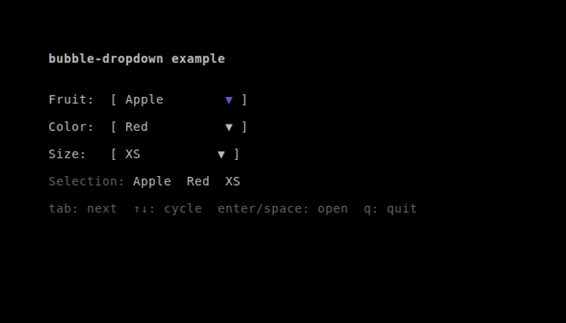
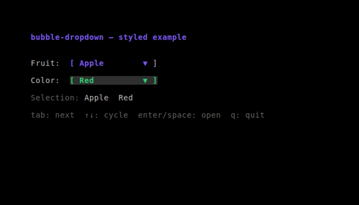

# bubble-dropdown

A [Bubble Tea](https://github.com/charmbracelet/bubbletea) dropdown component: a `[ Label ▼ ]` trigger that opens a scrollable selection panel as a [bubble-overlay](https://github.com/madicen/bubble-overlay) modal. Full keyboard and mouse support with bubblezone hit-testing.



## Installation

```bash
go get github.com/madicen/bubble-dropdown
```

## Quick start

```go
import bubbledropdown "github.com/madicen/bubble-dropdown"

// Create
d := bubbledropdown.New(
    bubbledropdown.WithOptions([]string{"Apple", "Banana", "Cherry"}),
    bubbledropdown.WithPlaceholder("Pick a fruit"),
)
d.SetZoneManager(zm) // optional; enable bubblezone hit-testing

// In View — call SetBounds every frame before building the zone mark
tw, th := d.TriggerSize()
d.SetBounds(row, col, tw, th)
mainView := zm.Mark("my-dropdown", d.TriggerView())
return d.ViewWithOverlay(mainView, width, height)
// (if using zm: wrap the final return in zm.Scan)

// In Update — forward all messages
d, cmd = d.Update(msg)

// Handle selection
case bubbledropdown.ItemChosenMsg:
    d.SetSelectedIndex(msg.Index)
```

See `examples/basic` for a full working example with three dropdowns and keyboard + mouse support, and `examples/styled` for fully customized appearance.

## Styling

Every visible part of the dropdown can be styled via options. `WithAccentColor` is the quickest path — it recolors the panel border, the highlighted row, and the focused trigger arrow in one go. For finer control, override individual lipgloss styles. Custom styles take precedence over the accent color where they overlap.



```go
d := bubbledropdown.New(
    bubbledropdown.WithOptions([]string{"Apple", "Banana", "Cherry"}),

    // One accent color recolors border + highlight + focused arrow
    bubbledropdown.WithAccentColor("#7D56F4"),

    // …or override individual styles for full control
    bubbledropdown.WithTriggerStyle(lipgloss.NewStyle().Bold(true)),
    bubbledropdown.WithListStyle(
        lipgloss.NewStyle().Border(lipgloss.ThickBorder()),
    ),
    bubbledropdown.WithItemStyle(
        lipgloss.NewStyle().Padding(0, 1).Foreground(lipgloss.Color("245")),
    ),
    bubbledropdown.WithCursorStyle(
        lipgloss.NewStyle().Padding(0, 1).Bold(true).
            Background(lipgloss.Color("#2ECC71")).Foreground(lipgloss.Color("16")),
    ),
)
```

> **Note:** `WithItemStyle` and `WithCursorStyle` should keep symmetric horizontal padding (e.g. `Padding(0, 1)`) so item rows align with the panel's computed width.

Run it: `go run ./examples/styled`

## Keyboard controls

| Context            | Key                  | Action                                  |
|--------------------|----------------------|-----------------------------------------|
| Trigger focused    | `Enter` / `Space`   | Open the dropdown panel                 |
| Trigger focused    | `↑` / `↓`           | Cycle selection without opening         |
| Trigger focused    | `Tab` / `Shift+Tab` | Move focus (handled by your app)        |
| Panel open         | `↑` / `↓`           | Move cursor through options             |
| Panel open         | `Enter`             | Confirm selection → `ItemChosenMsg`     |
| Panel open         | `Esc`               | Cancel → `ItemCanceledMsg`             |

## Mouse controls

| Action                       | Result                                              |
|------------------------------|-----------------------------------------------------|
| Click trigger                | Open the panel                                      |
| Click option row             | Confirm selection → `ItemChosenMsg`                 |
| Hover over option row        | Move cursor highlight                               |
| Scroll wheel inside panel    | Move cursor                                         |
| Click outside open panel     | Cancel → `ItemCanceledMsg`                         |

## API

### `New(opts ...Option) *Dropdown`

Creates a new Dropdown. All configuration is done through options.

### Options

| Option | Description |
|---|---|
| `WithOptions([]string)` | Selectable items |
| `WithInitialIndex(int)` | Initially selected item (default 0) |
| `WithPlaceholder(string)` | Text shown when nothing is selected (default `"Select…"`) |
| `WithMaxVisible(int)` | Max items shown before scrolling (default 8) |
| `WithAccentColor(string)` | Color used for the default border, highlight, and focused arrow (e.g. `"62"` or `"#7D56F4"`) |
| `WithTriggerStyle(lipgloss.Style)` | Override the closed trigger style |
| `WithListStyle(lipgloss.Style)` | Override the open panel border style |
| `WithItemStyle(lipgloss.Style)` | Override non-highlighted item rows |
| `WithCursorStyle(lipgloss.Style)` | Override the highlighted (hover/cursor) item row |

### Methods

```go
// Positioning — call every frame before building view
d.SetBounds(row, col, w, h int)
d.TriggerSize() (width, height int)

// Rendering
d.TriggerView() string
d.ViewWithOverlay(mainView string, viewWidth, viewHeight int) string

// State
d.Open() bool
d.Focused() bool
d.SetFocused(bool)
d.Selected() string
d.SelectedIndex() int
d.SetSelectedIndex(i int)

// Zone support
d.SetZoneManager(*zone.Manager)

// Message loop
d.Update(tea.Msg) (*Dropdown, tea.Cmd)
```

### Messages

```go
// Emitted when the user picks an item
type ItemChosenMsg struct {
    Index int    // zero-based index into the options slice
    Value string // the selected option string
}

// Emitted when the user dismisses without selecting
type ItemCanceledMsg struct{}
```

## Embedding pattern

The standard embed pattern (mirrors [bubble-color-picker](https://github.com/madicen/bubble-color-picker)'s SwatchPicker):

```go
type appModel struct {
    width, height int
    zm            *zone.Manager
    dropdowns     []*bubbledropdown.Dropdown
    focused       int
}

func (a *appModel) View() string {
    mainView := a.buildMainView() // calls SetBounds + zm.Mark inside
    for _, d := range a.dropdowns {
        mainView = d.ViewWithOverlay(mainView, a.width, a.height)
    }
    return a.zm.Scan(mainView)
}

func (a *appModel) buildMainView() string {
    tw, th := a.dropdowns[0].TriggerSize()
    a.dropdowns[0].SetBounds(3, 8, tw, th)
    return a.zm.Mark("fruit", a.dropdowns[0].TriggerView())
}

func (a *appModel) Update(msg tea.Msg) (tea.Model, tea.Cmd) {
    // Route to the open dropdown exclusively
    for i, d := range a.dropdowns {
        if d.Open() {
            a.dropdowns[i], cmd = d.Update(msg)
            return a, cmd
        }
    }
    // Route mouse clicks to the zone-matched dropdown
    if m, ok := msg.(tea.MouseMsg); ok && m.Action == tea.MouseActionPress {
        if a.zm.Get("fruit").InBounds(m) {
            a.dropdowns[0], cmd = a.dropdowns[0].Update(msg)
            return a, cmd
        }
    }
    // Broadcast to focused dropdown for keys
    a.dropdowns[a.focused], cmd = a.dropdowns[a.focused].Update(msg)
    return a, cmd
}
```

## Panel positioning

The panel opens **below** the trigger by default. When there is not enough room below (the panel would exceed the terminal height), it automatically flips **above** the trigger. `bubble-overlay`'s `ClampedOrigin` ensures the panel stays within the viewport at all times.

## Dependencies

- [charmbracelet/bubbletea](https://github.com/charmbracelet/bubbletea) — Bubble Tea TUI framework
- [charmbracelet/lipgloss](https://github.com/charmbracelet/lipgloss) — terminal styling
- [lrstanley/bubblezone](https://github.com/lrstanley/bubblezone) — mouse zone hit-testing
- [madicen/bubble-overlay](https://github.com/madicen/bubble-overlay) — overlay compositing

## License

MIT
